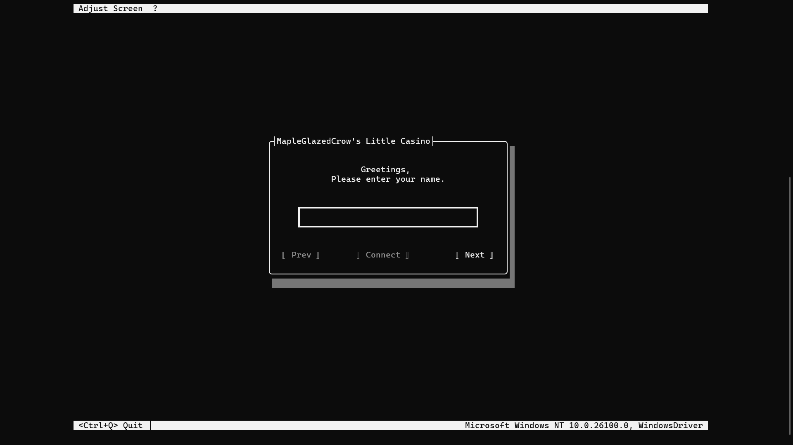

# MGC_CasinoGames (Terminal.Gui + .NET)

A cross-platform multiplayer casino game (right now only implementing Blackjack) built in **C#/.NET 8** using **Terminal.Gui** for the TUI (text-based interface) and a custom TCP client/server architecture.  

This project was designed to be **modular**, so other card games can be plugged into the same library and network flow in the future.

---

## Features

- **Multiplayer** – play with friends over LAN or internet (I only implemented basic token validation upon connection) 
- **Text-based UI** – retro style, built with [gui-cs/Terminal.Gui](https://github.com/gui-cs/Terminal.Gui)  
- **Client-Server Architecture** – TCP networking with structured JSON messages  
- **Lobby Authentication** – room codes system for secure joins  
- **Timers** – server-driven phase timers with real-time client updates  
- **Modular Game Library** – abstracted `GameState`, `Player`, `Hand` models for other games (not just Blackjack)  
- **Event system** – broadcast game state and player actions to all clients  

---

## Screenshots




---

## Project Structure

root/<br>
├─ **CardGamesLibrary/** # Core abstractions (`GameState<T>`, `Player<THand>`, `Identifier`, etc.)<br>
│ └─ **CardGamesLibrary.csproj**<br>
│ └─ **Blackjack/** # Blackjack-specific logic (`Player`, `PlayerHand`, `DealerHand`, etc.)<br>
│ └─ **Security/** # Room codes logic (`Player`, `PlayerHand`, `DealerHand`, etc.)<br>
│<br>
├─ **CasinoServer/** # Hosts lobbies, manages game flow, validates player actions, and broadcasts state updates<br>
│ └─ **CasinoServer.csproj**<br>
│ └─ **Blackjack/** # Blackjack-specific logic (`BlackjackClient`, `BlackjackView`, `PlayerView`)<br>
│<br>
├─ **CasinoPlayerClient/** # Connects to server, renders the game UI, handles player input<br>
│ └─ **CasinoPlayerClient.csproj**<br>
│<br>
└─ **README.md**

Networking is JSON-based and uses **strongly typed messages** (`MessageFactory`, `Message` and `MessageType`) for actions and state updates.

---

## Getting Started

### Prerequisites
- [.NET 8 SDK](https://dotnet.microsoft.com/download)  
- A terminal that supports ANSI colors (for the best experience)  

### Clone the Repository
```sh
git clone https://github.com/MapleGlazedCrow/MGC_CasinoGames.git
cd MGC_CasinoGames
```

## Build Instructions

### Library
```
cd CardGamesLibrary
dotnet build -c Release
cd ..
dotnet nuget add source "$(pwd)/CardGamesLibrary/bin/Release" -n LocalPackages
```
### Server
```
cd server
dotnet build -c Release
```

```
cd .\bin\Release\net8.0\
.\CasinoServer.exe
```
### Client
```
cd client
dotnet build -c Release
```

```
cd .\bin\Release\net8.0\
.\CasinoPlayerClient.exe
```

---

## Lobby Authentication

- When the server starts, it generates a room code (Base32 token).
- Players join by providing the code, their username, their chip amount and the server ip and port.
- Server verifies and assigns them to available seats.

---

## Roadmap

- Implement more card games using the same library.

---

## License
This project is licensed under the MIT License.
